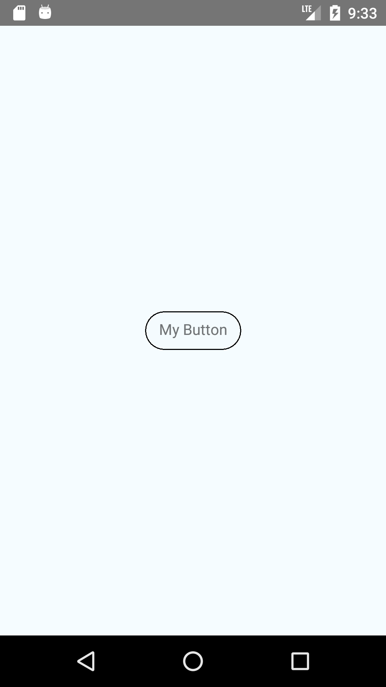
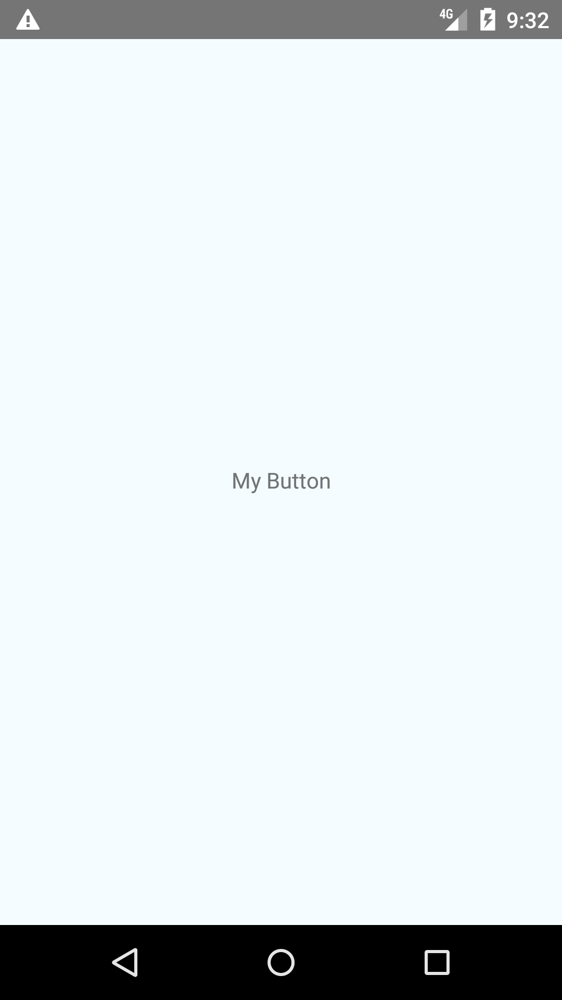
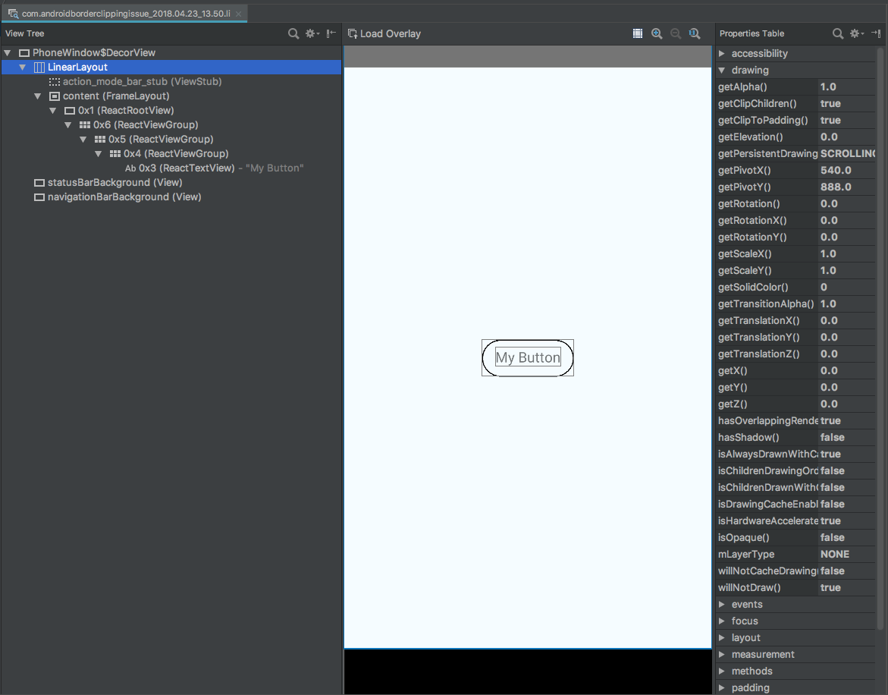

# Clipping

This repository demonstrates a clipping issue with view that have border radius set on Android API levels < 23 for React Native. It occurs on both React Native 0.52.0 and 0.55.0.

## Reference rendering on API level 23

## How it renders on API level 21 and other API levels < 23

*Note the lack of the border on the button in this case.*

In the Android Layout inspector it's evident that the border is being rendered, but the outer view meant to contain the Touchable feedback is clipping it somehow. This does not happen on API level 23.

